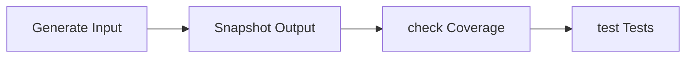
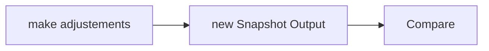

## Golden Master Technique




### The simplest case


Coverage Analysis with transaction **SCOV**


Now the screenshotet outputs could be compared with [WinMerge](https://winmerge.org/).


### Automation with ABAP Unit and classic reports
Testing isolated form with return

```abap
REPORT zunit_test_forms.

START-OF-SELECTION.
  DATA: summe TYPE int4.
  PERFORM addiere USING 1 2 CHANGING summe.

FORM addiere USING sum1 sum2 CHANGING summe.
  summe = sum1 + sum2.
ENDFORM.

CLASS addierer_tests DEFINITION FINAL FOR TESTING
RISK LEVEL HARMLESS.
  PRIVATE SECTION.
    METHODS: akz_add_1_and_2_equals_3 FOR TETING RAISING cx_static_check.
ENDCLASS.

CLASS addiere_tests IMPLEMENTATION.
  METHOD akz_add_1_and_2_equals_3.
    DATA: sum_actual TYPE int4.
    
    PERFORM addiere IN PROGRAM zunit_test_forms USING 1 2 CHANGING sum_actual.
    
    cl_abap_unit_assert=>assert_equals( exp = 3 act = sum_actual ).
  ENDMETHOD.
ENDCLASS.

```
### Automation with ABAP Unit and classic reports
Testing local class with return

```abap
CLASS addierer DEFINITION.
  PUBLIC SECTION.
    METHODS addiere IMPORTING sum1 TYPE int4
                              sum2 TYPE int4
                    RETURNING VALUE(summe) TYPE int4.
ENDCLASS.

CLASS addierer IMPLEMENTATION.
  METHOD addiere.
    summe = sum1 + sum2.
  ENDMETHOD.
ENDLCASS.

START-OF-SELECTION.
  DATA(addierer) = NEW addierer().
  DATA(summe) = addierer->addiere(
                            sum1 = 1
                            sum2 = 2 ).
  WRITE summe.

CLASS addierer_tests DEFINITION FINAL FOR TESTING
RISK LEVEL HARMLESS.
  PRIVATE SECTION.
    METHODS: akz_add_1_and_2_equals_3 FOR TETING RAISING cx_static_check.
ENDCLASS.

CLASS addiere_tests IMPLEMENTATION.
  METHOD akz_add_1_and_2_equals_3.
    DATA(sum_actual) = addierer->addiere(
                                  sum1 = 1
                                  sum2 = 2 ).
    cl_abap_unit_assert=>assert_equals( exp = 3 act = sum_actual ).
  ENDMETHOD.
ENDCLASS.
```
