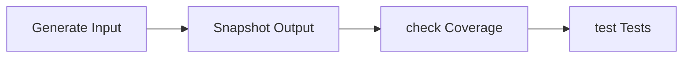
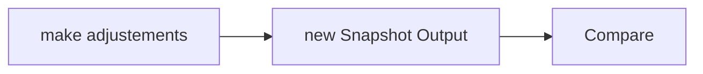

## Golden Master Technique





### The simplest case


Coverage Analysis with transaction **SCOV**


Now the screenshotet outputs could be compared with [WinMerge](https://winmerge.org/).


### Automation with ABAP Unit and classic reports

Testing isolated form with return

```abap
REPORT zunit_test_forms.

START-OF-SELECTION.
  DATA: summe TYPE int4.
  PERFORM addiere USING 1 2 CHANGING summe.

FORM addiere USING sum1 sum2 CHANGING summe.
  summe = sum1 + sum2.
ENDFORM.

CLASS addierer_tests DEFINITION FINAL FOR TESTING
RISK LEVEL HARMLESS.
  PRIVATE SECTION.
    METHODS: akz_add_1_and_2_equals_3 FOR TETING RAISING cx_static_check.
ENDCLASS.

CLASS addiere_tests IMPLEMENTATION.
  METHOD akz_add_1_and_2_equals_3.
    DATA: sum_actual TYPE int4.

    PERFORM addiere IN PROGRAM zunit_test_forms USING 1 2 CHANGING sum_actual.

    cl_abap_unit_assert=>assert_equals( exp = 3 act = sum_actual ).
  ENDMETHOD.
ENDCLASS.

```

### Automation with ABAP Unit and classic reports

Testing local class with return

```abap
CLASS addierer DEFINITION.
  PUBLIC SECTION.
    METHODS addiere IMPORTING sum1 TYPE int4
                              sum2 TYPE int4
                    RETURNING VALUE(summe) TYPE int4.
ENDCLASS.

CLASS addierer IMPLEMENTATION.
  METHOD addiere.
    summe = sum1 + sum2.
  ENDMETHOD.
ENDLCASS.

START-OF-SELECTION.
  DATA(addierer) = NEW addierer().
  DATA(summe) = addierer->addiere(
                            sum1 = 1
                            sum2 = 2 ).
  WRITE summe.

CLASS addierer_tests DEFINITION FINAL FOR TESTING
RISK LEVEL HARMLESS.
  PRIVATE SECTION.
    METHODS: akz_add_1_and_2_equals_3 FOR TETING RAISING cx_static_check.
ENDCLASS.

CLASS addiere_tests IMPLEMENTATION.
  METHOD akz_add_1_and_2_equals_3.
    DATA(sum_actual) = addierer->addiere(
                                  sum1 = 1
                                  sum2 = 2 ).
    cl_abap_unit_assert=>assert_equals( exp = 3 act = sum_actual ).
  ENDMETHOD.
ENDCLASS.
```

### Automation with ABAP Unit and classic reports

Testing without structuring with CALL TRANSACTION

```abap
REPORT zunit_test_no_structure.

PARAMETERS: sum1 TYPE int4,
            sum2 TYPE int4.

START-OF-SELECTION.
  DATA(summe) = sum1 + sum2.
  IF summe = 0.
    MESSAGE |ERROR: 0| TYPE 'E'.
  ELSE.
    WRITE summe.
  ENDIF.

CLASS addierer_tests DEFINITION FINAL FOR TESTING
RISK LEVEL HARMLESS.
  PRIVATE SECTION.
    METHODS: addiere_call_transaction FOR TESTING.
ENDLCASS.

CLASS addierer_tests IMPLEMENTATION.
  METHOD addiere_call_transaction.
    DATA: messages TYPE STANDARD TABLE OF bscmscoll.

    DATA(batchdata) = VALUE bdcdata_tab( ( programm = 'ZUNIT_TEST_NO_STRUCTURE' dynpro = '1000' dynbegin = 'X' fnam = '' fval = '' )
    ( programm = 'ZUNIT_TEST_NO_STRUCTURE' dynpro = '1000' dynbegin = '' fnam = 'SUM1' fval = '0' )
    ( programm = 'ZUNIT_TEST_NO_STRUCTURE' dynpro = '1000' dynbegin = '' fnam = 'SUM2' fval = '0' ) ).

  CALL TRANSACTION 'ZUNIT_TEST_NO_STRUCTURE'
    USINF batchdata
    MODE 'N' UPDATE 'A'
    MESSAGES INTO messages.

  cl_abap_unit_assert=>assert_equals(
    EXPORTING
      exp = |ERROR: 0|
      act = messages[ 1 ]-msgv1 ).
  ENDMETHOD.
ENDCLASS.
```

### BUT what if...

- The Golden Master is big?
- There is no output that you could simply tap?
- random numbers are involved?
- GUIDs and number range objects are used?
- Queries take place on SY-DATUM?
- External APIs are addressed?
- Database changes are made?
- ...

Identify "seams" where "relatively safe" changes can be made
**Important:** log changes

### Import Golden Master data

- Hard coded in the test
- In unit tests via import from file / cluster table

```abap
DATA(golden_master) = zreal_golden_master=>read_master_table( key = 'GM1' ).

" call coding that should be tested

cl_abap_unit_assert=>assert_equals(
    EXPORTING
      exp = actual_result
      act = golden_master ).
```

### Generate Outputs

- Insert write statements
- Insert ALV
- Output messages
- Insert return parameters
- Memory export / import
- Use buffer database
- Use cluster tables
- Call up your own logger
- etc.

### How to deal with database changes?

- INSERTs / MODIFY etc. can be problem-free
- Comment out
- Replace with your own database tables
- explicit deletion of INSERTs

## GUIDS / Number Range Objects / Random Numbers / APIs

1. Do not include GUIDS / number ranges in the comparison with the Golden Master
2. Reset number range objects after each run
3. Return GUIDs statically
4. Replace random numbers with fixed values
5. Replace SY-DATUM with a fixed value
6. Disable APIS / replace with fixed values
7. Except: API calls are our result! Then log

### Replace dependencies with fake data

Via interfaces, without a framework

```abap
START-OF-SELECTION.
  DATA: sysdate TYPE dats.

  sysdate = sy-datum.
  WRITE / sysdate.
```

```abap
INTERFACE zif_calendar PUBLIC.
  METHODS: get_today RETURNING VALUE(today) TYPE dats.
```

```abap
CLASS zcalendar DEFINITION PUBLIC FINAL CREATE PUBLIC.
  PUBLIC SECTION.
    INTERFACES zfi_calendar.
ENDCLASS.

CLASS zcalendar IMPLEMENTATION.
  METHOD zfi_calendar~get_today.
    today = sy-datum.
  ENDMETHOD.
ENDCLASS.
```

```abap
CLASS zcalendar_fake_christmas DEFINITION PUBLIC FINAL CREATE PUBLIC.
  PUBLIC SECTION.
    INTERFACES zfi_calendar.
ENDCLASS.

CLASS zcalendar IMPLEMENTATION.
  METHOD zfi_calendar~get_today.
    CONSTANTS: christmas TYPE dats VALUE |20221224|.
    today = christmas.
  ENDMETHOD.
ENDCLASS.
```

```abap
START-OF-SELECTION.
  DATA: sysdate TYPE dats.

  sysdate = sy-datum.
  WRITE / sysdate.

  DATA: calendar TYPE REF TO zfi_calendar.
  calendar = NEW zcalendar( ).
  sysdate = calendar->get_today( ).
  WRITE / sysdate.

  calendar = NEW zcalendar_fake_christmas( ).
  sysdate = calendar->get_today( ).
  WRITE / sysdate.
```

Output:

```
26.11.2022
26.11.2022
24.12.2022
```

With Test Double Framework

```abap
START-OF-SELECTION.
DATA: sysdate TYPE dats.

  sysdate = sy-datum.
  WRITE / sysdate.
```

```abap
INTERFACE zif_calendar PUBLIC.
  METHODS: get_today RETURNING VALUE(today) TYPE dats.
ENDINTERFACE.
```

```abap
METHOD tagesdatum_ist_jahresanfang.
  DATA: calendar_double TYPE REF TO zif_calendar.
  CONSTANTS: year_start TYPE dats VALUE '20220101'.

  calendar_double ?= cl_abap_testdouble=>creat( 'zif_calendar' ).
  cl_abap_testdouble=>configure_call( calendar_double )->returning( year_start ).

  calendar_double->get_today( ).
  DATA(today) = calendar_double->get_today( ).

  cl_abap_unit_assert=>assert_equals( exp = year_start act = today ).
```

With Test Seams

```abap
START-OF-SELECTION.

  DATA: summe TYPE int4.

  PERFORM addiere USING 1 2 CHANGING summe.
  WRITE / summe.
  WRITE / sy-datum.

FORM addiere USINF sum1 sum2 CHANGING summe.
  summe = sum1 + sum2.
ENDFORM.
```

```abap
START-OF-SELECTION.

  DATA: summe TYPE int4.

  PERFORM addiere USING 1 2 CHANGING summe.
  WRITE / summe.
  TEST-SEAM today.
    WRITE / sy-datum.
  END-TEST-SEAM.

FORM addiere USINF sum1 sum2 CHANGING summe.
  summe = sum1 + sum2.
ENDFORM.
```

```abap
CLASS zcalendar_test_seam DEFINITION PUBLIC FINAL CREATE PUBLIC.
  PUBLIC SECTION.
    INTERFACES zif_calendar.
ENDCLASS.

CLASS zcalendar_test_seam IMPLEMENTATION.
  METHOD zif_calendar~get_today.
    TEST-SEAM today.
        today = sy-datum.
    END-TEST-SEAM.
  ENDMETHOD.
ENDLCASS.
```

```abap
CLASS calendartest DEFINITION FINAL FOR TESTING DURATION SHORT RISK LEVEL HARMLESS.
  PRIVATE SECTION.
    METHODS:
      today_is_christmas FOR TESTING RAISING cx_static_check.
ENDLCASS.

CLASS calendartest IMPLEMENTATION.
  METHOD today_is_christmas.
    CONSTANTS: chsitmas2022 TYPE dats VALUE '20221224'.
    TEST-INJECTION today.
      today = `20221224`.
    END-TEST-INJECTION.

    DATA(today) = NEW zcalendar_test_seam( ).->zfi_calendar~get_today( ).
    cl_abap_unit_asser=>assert_equals( exp = christmas2022 act = today ).
  ENDMETHOD.
ENDLASS.
```

### Code is now under test - what's next?

Just not like before!
“Leave the code cleaner than you leave it have found."

Improve code without functional change

1. Capture insights
   - Significantly rename forms/methods
   - Name variables meaningfully
   - Insert comments
   - Write documentation
2. create order
   - Extract methods
   - Remove commented out coding
   - Correct formatting
   - Increase readability (EQ, GT etc.)
3. Improve testability
   - Extract database accesses in class
   - Extract API calls in class

Insert new functions – Sprout Method / Sprout Class

```abap
CLASS zsome_demo_class IMPLEMENTATION.
  METHOD do_something.

  " ... complex code here

  LOOP AT list ASSIGNING FIELD-SYMBOL(<listitem>).
    process( <listitem> ).
    save( <listitem> ).
  ENDLOOP.

  " ... some more code here
ENDMETHOD.

" ...
```

```abap
METHOD dedupliacte_empty_list.
  DATA: list         TYPE tt_evopd,
        expectedlist TYPE tt_evopd.

  DATA(democlass) = NEW zsome_demo_class( ).
  DATA(deduplicatelist) = democlass->deduplicate( list ).
  cl_abap_unit_assert=>assert_equals( exp = expectedlist act = deduplicatedlist ).
ENDMETHOD.
```

```abap
  METHOD do_something.

  " ... complex code here

  LOOP AT list ASSIGNING FIELD-SYMBOL(ylistitem>).
    process( <listitem> ).
    save( <listitem> ).
  ENDLOOP.

  " ... some more code here
ENDMETHOD.
```

```abap
CLASS zsome_demo_class IMPLEMENTATION.
  METHOD do_something.

  " ... complex code here

  DATA(dedulicatelist) = zdeduplicateor=>dedublicatedlist( list ).

  LOOP AT list ASSIGNING FIELD-SYMBOL(<listitem>).
    process( <listitem> ).
    save( <listitem> ).
  ENDLOOP.

  " ... some more code here
ENDMETHOD.

" ...
```
