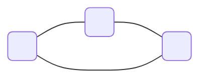
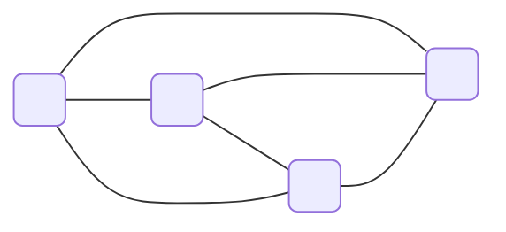
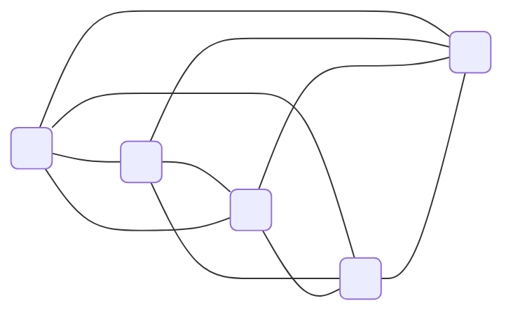

## DevOps

### Basics

Development + Operations = DevOps

#### Definition:

A pretty good defintion of DevOps:

> **DevOps:** A culture where people, regardless of title or background, work together to imagine, develop, deploy and operate a system.

~ Ken Mugrage, Thoughtworks

#### CALMS

- Culture
- Automation
- Lean
- Measurment
- Sharing

### Cultural Aspects

#### The five dysfunctions of a team

1. Inattention to results
2. Avoidance of accountability
3. Lack of commitment
4. fear of conflict
5. Absence of trust

#### A defintion of trust

> The state of readiness for unguarded interaction with someone or something.

~ "A construct of Trust" 1993 – Dr. Duane C. Tway Jr. 

#### How to measure trust

Trust = Speed

**Communication and team size**

> Adding manpower to a late software project makes it later.

~ “The mythical man-month” – Fred Brooks, 1975

$n(n-1)/2$

3 persons = 3 connections

4 persons = 6 connections

5 persons = 10 connections

