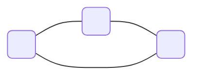
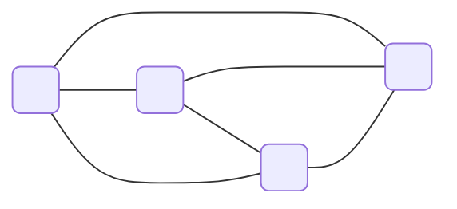
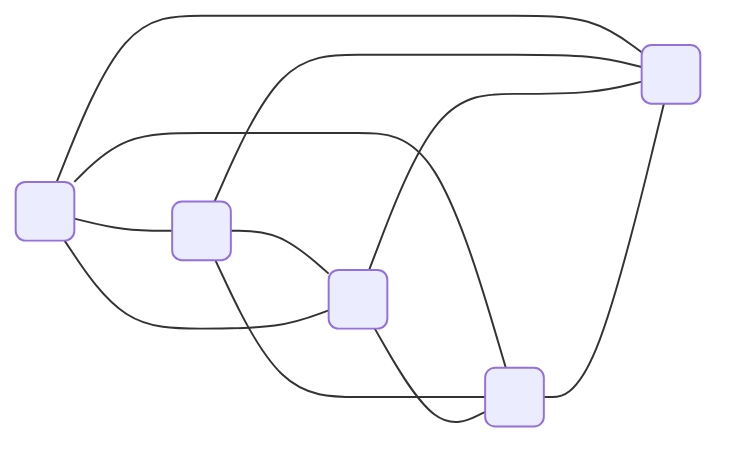
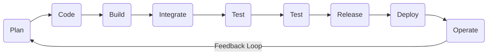
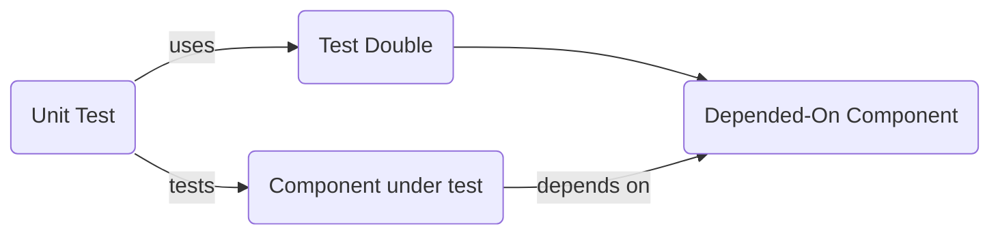
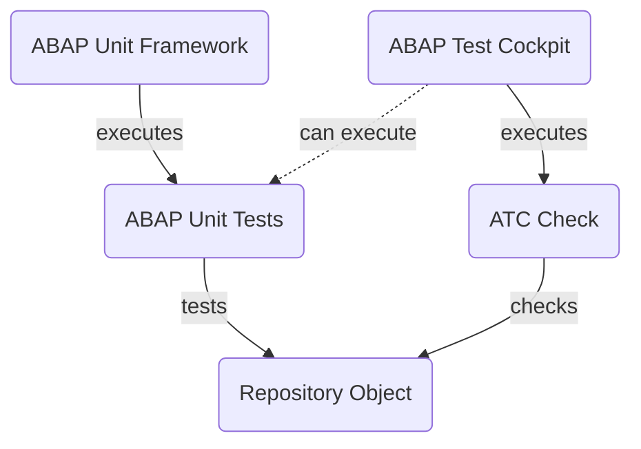
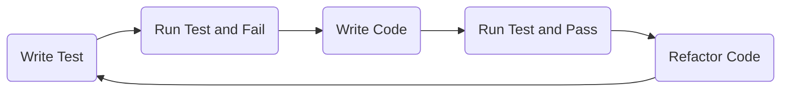

# DevOps

## Basics

Development + Operations = DevOps

### Definition:

A pretty good defintion of DevOps:

> **DevOps:** A culture where people, regardless of title or background, work together to imagine, develop, deploy and operate a system.

~ Ken Mugrage, Thoughtworks

### CALMS

- Culture
- Automation
- Lean
- Measurment
- Sharing

### Cultural Aspects

### The five dysfunctions of a team

1. Inattention to results
2. Avoidance of accountability
3. Lack of commitment
4. fear of conflict
5. Absence of trust

### A defintion of trust

> The state of readiness for unguarded interaction with someone or something.

~ "A construct of Trust" 1993 – Dr. Duane C. Tway Jr.

### How to measure trust

Trust = Speed

**Communication and team size**

> Adding manpower to a late software project makes it later.

~ “The mythical man-month” – Fred Brooks, 1975

$$\frac{n(n-1)}{2}$$

$$3 persons = 3 connections$$

$$4 persons = 6 connections$$

$$5 persons = 10 connections$$

### Stable social relationships

**Dunar's number** is a suggested cognitive limit to the number of people with whom one can maintain stable social relationships.

- 5
- 15 (Trusted friends)
- 35
- 150 (Dunar's number)
- 500
- 1500

### Minimal group paradigm

> Minimal group paradigm simple categorization into groups seems to be sufficient reason for people to dispense valued rewards in ways that favor in-group members over those who are 'different'.

~ Social Identity and Intergroup Behavior, 1974

### How to foster trust?

- Team size
- Diversity
- Safety

## Organizational Design Patterns

### Conway’s law

> Organizations which design systems [...] are constrained to produce designs which are copies of the communication structures of these organizations.

~ Melvin Conway, 1970

- Architectures are constrained to organizations’ communication structures
- In the event of doubt, communication structures overrule architecture...

### The goal of your organizational design pattern

**Reduce team’s cognitive load**

- Stream-aligned team
  - Works along the value stream on (parts of) the product
- Platform team
  - Centralize common work loads
  - Consumable via “service”
- Enablement team
  - Consult, teach, and support teams to increase flow
- Complicated-subsystem team
  - Does the technology heavy lifting

## Continuous Integration and Continuous Delivery (CI/CD)

### Terminology

**Continuous Integration**

- One main code line where developers push their changes to, at least once per day
- Automated test system (CI server) that automatically qualifies every change
- Team’s goal is to keep main code line buildable and testable

**Continuous Delivery**

- Everything that continuous integration demands
- Software is always ready to be deployed to production system
- Deployment to production system is manual decision
- Get feedback fast from production system back into backlog of team

**Contious Deployment**

- Everything that continuous delivery demands
- Deployment to production system is automated

### The benefits of continuously delivering software changes

Small changes, deployed frequently.

### The deployment pipeline

### The goal of continuous delivery

- Build quality in
- Faster deployment
- Faster feedback
- Better software
- Happier customers

## Quality Strategy in DevOps

A quality strategy in DevOps is a framework of desired values for our users that can be achieved by improving our system.

&#8594; CALMS

## When and Why DevOps with ABAP

### CTS – Where ABAP comes from

Change and Transport System (CTS) has been an integral part of ABAP development processes since the beginning
With CTS, you:

- Model system landscapes (e.g. DEV &#8594; TEST &#8594; PROD)
- Transport changes through the landscape
- Monitor your transports
- Can integrate into Change Request Management (ChaRM) and Quality Gate Management (QGM)

&#8594; Safe and controlled

### DevOps – Where ABAP should go

The developers’ world has changed:

- DevOps processes are widely used
- Git is used to manage development artifacts
- Automation servers (e.g. Jenkins) are used to automate DevOps processes

&#8594; One ‘world of tools’ for many development languages / environments

### DevOps – Get ABAP in

It should be possible to add ABAP to the
DevOps world:

- To share source code on Git
- To enable automation of development
  processes via pipelines
- To manage ABAP development similar to what
  you do in other languages and environments

&#8594; This is what Git-enabled CTS (gCTS) aims at

## Introduction to Git-Enabled Change and Transport System (gCTS)

CTS (Change and Transport System) + git = gCTS (Git-enabled CTS)

### What Systems do I need?

- Git platform
- ABAP systems
- CI Server (optinal - e.g. Jenkins)

## Continuous Testing in ABAP

### Types of testing

- manual tests
- scenario tests
- system tests
- integration tests
- component tests
- unit tests

&#8594; the most testing should happen during unit testing.

### Shift-left testing

Resolve problems as early as possible by shifting quality controls left.

### Unit testing

Unit tests focus on a single unit of source code. Everything around that unit is replaced by test
doubles (dependency isolation).

### Quality in ABAP development

Central tools for ABAP quality: ABAP Unit Framework and ABAP Test Cockpit (ATC)

### Unit testing with ABAP Unit and test-driven development

ABAP Unit checks the functional correctness of the tested object and verifies the intended program behavior at runtime. In test-driven development (TDD), unit tests drive the development process. ABAP Unit provides excellent 
support for TDD.

### ABAP Test Cockpit – One tool for all quality aspects

ATC Framework measures the quality of the 
ABAP code and detects related issues.
- Central infrastructure for functional, performance, security code checks
- Uniform quality criteria for your whole system landscape
- Quality assurance processes minimize errors in production systems
- Smooth migration of ABAP code to SAP HANA and SAP S/4HANA
- Extensible infrastructure for customer-specific checks

### Remote code analysis with ATC

Central ATC system to analyze custom code 
in whole landscape
- Remote stubs return a model from custom code
- Check logic is executed on central system
- Result is analyzed in central system
- Integrated in the development system
- All kinds of custom code are supported (incl. modifications and enhancements)
- Suppress false-positive findings with pseudocomments
- Essential for custom code migration to SAP S/4HANA
